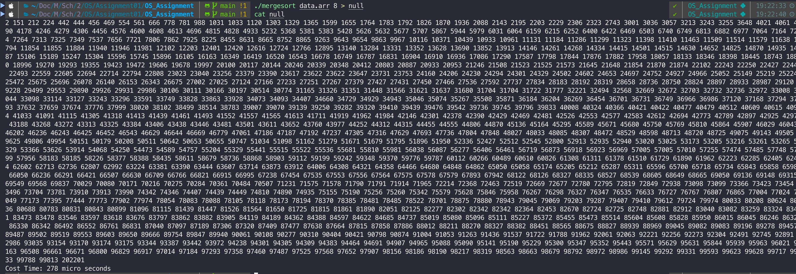
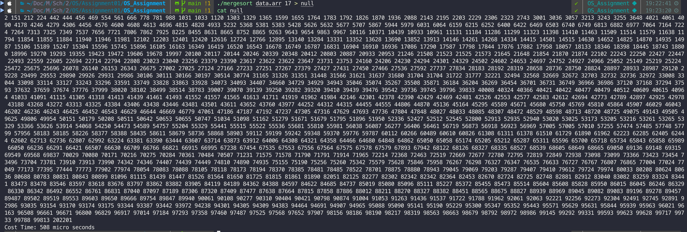
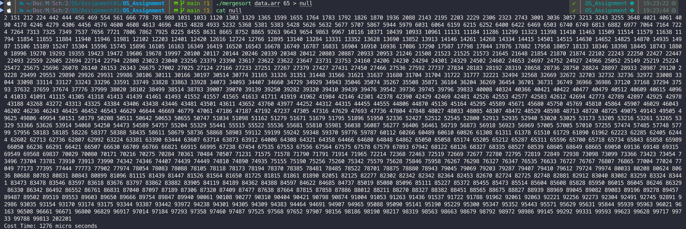
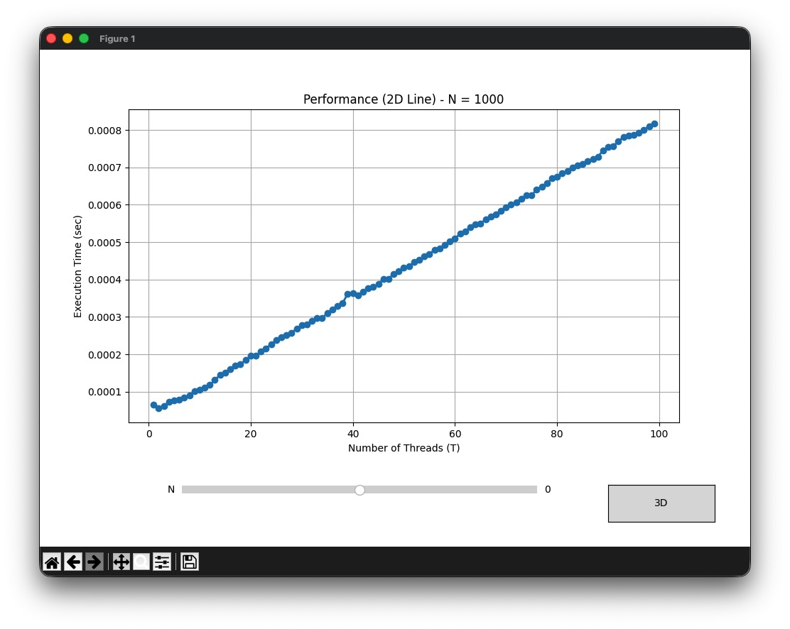
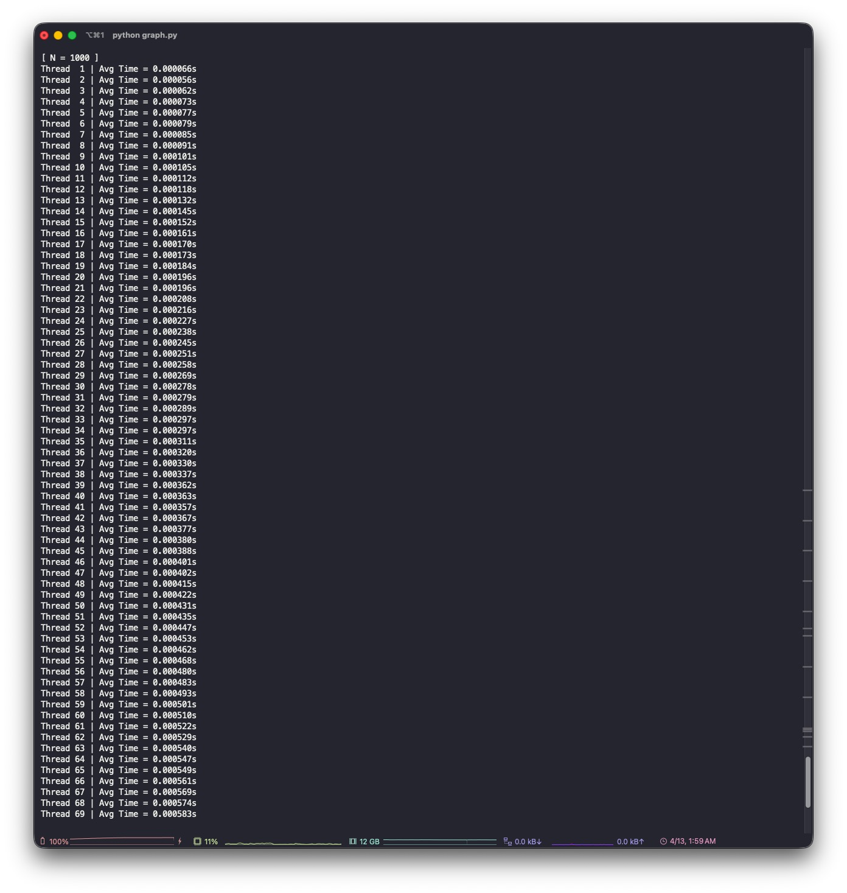
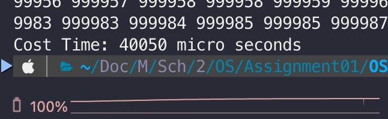
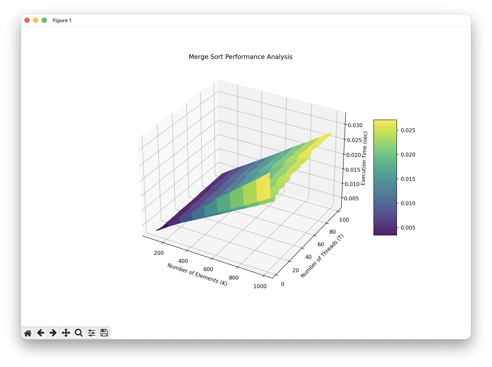
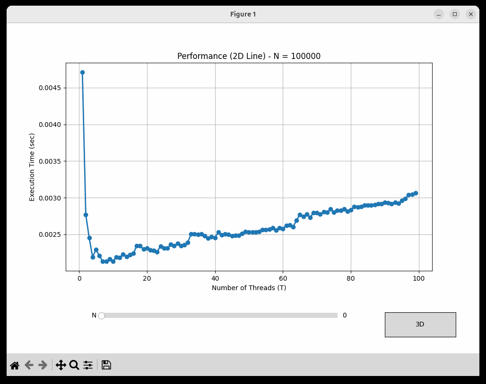
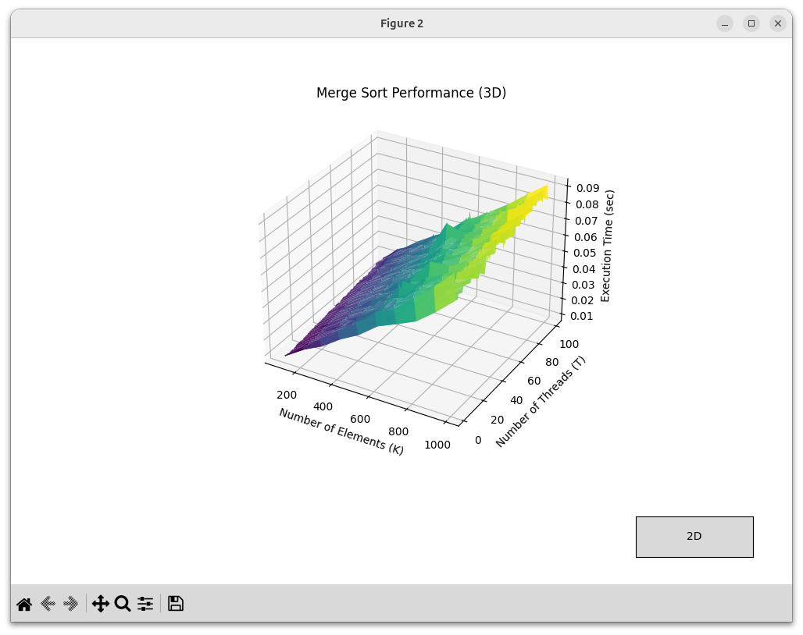
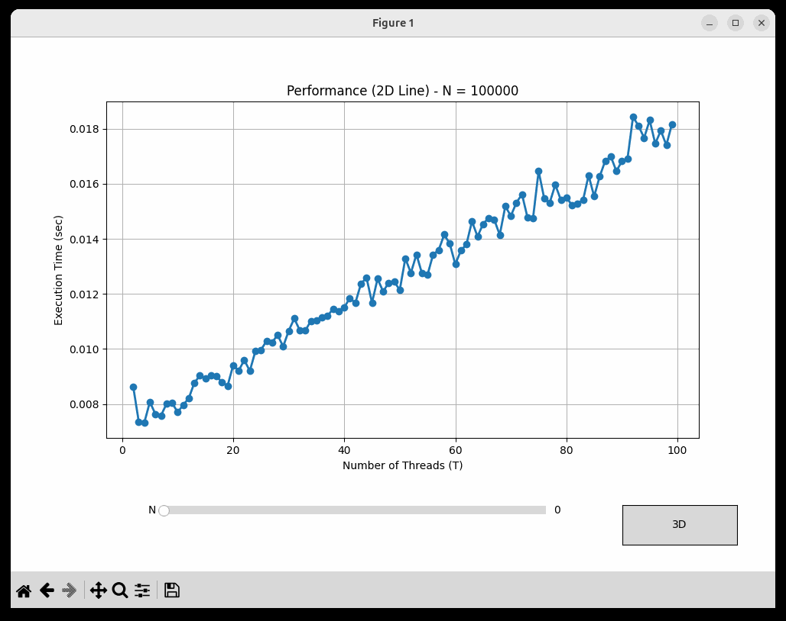

# OS Assignment 1: Multi-threaded Merge Sort

본 프로젝트는 운영체제 과제 제출용으로 작성된 멀티스레드 기반 병합 정렬(Merge Sort) 프로그램과, 하드웨어별 성능 분석을 위한 파이썬 프로그램이다.

## Assignment 01
- 과목명: 운영체제 (01분반)
- 지도교수: 조희승 교수님
- 학번: 2022041069
- 학년: 3
- 이름: 이인수

## 개발 및 검증 환경
- 통합 개발 환경(IDE): Neovim (nvim)
- 주 개발 환경: macOS (Apple Silicon M4)
- 교차 검증 환경: Ubuntu 64-bit (가상 머신, 할당 자원: CPU 4 Cores, Memory 12GB)
- 컴파일러: GCC (Apple clang version 17.0.0 (clang-1700.6.4.2) / Ubuntu 13.3.0-6ubuntu2-24.04.1 13.3.0)

------
## 구현 최적화 사항

실행 성능을 높이기 위해 다음과 같은 최적화를 적용하였다.

### 1. mmap 기반 고속 파일 입력

일반적인 `fopen` / `getline` 방식 대신 `mmap`(메모리 매핑)을 사용하여 파일을 읽는다.

| 방식 | 동작 |
|------|------|
| `fopen` / `getline` | 커널 버퍼 → 유저 버퍼로 데이터를 복사하며 읽음 |
| `mmap` | 파일을 가상 주소 공간에 직접 매핑, 복사 없이 접근 |

`mmap`은 파일 전체를 메모리에 직접 매핑하여 불필요한 시스템 콜 오버헤드와 버퍼 복사를 제거한다.
데이터 크기가 클수록 이 차이가 입력 처리 속도에 직접적인 영향을 미친다.

### 2. fast_itoa 기반 고속 출력

정렬 결과 출력 시 `printf("%d", ...)` 대신 직접 구현한 `fast_itoa` 함수를 사용한다.

`printf`는 포맷 문자열 파싱, 내부 버퍼 관리 등의 오버헤드가 존재한다.
`fast_itoa`는 정수를 문자 배열로 직접 변환한 뒤, 하나의 큰 버퍼에 연속으로 기록하고
`fwrite`로 한 번에 출력함으로써 시스템 콜 횟수를 최소화한다.

특히 `INT_MIN`의 절댓값이 `int` 범위를 초과하는 오버플로우 문제를 `unsigned int` 캐스팅으로 처리하였다.

```c
// INT_MIN 처리: -(INT_MIN)은 int 범위 초과 → unsigned int로 캐스팅
uval = (unsigned int)-(val);
```

출력할 값들이 많을수록 `printf`대비 성능이 차이난다.

---

## C 프로그램 단독 실행 방법

pthread를 활용하여 구현된 멅리스레드 정렬 프로그램.

### 컴파일
```bash
gcc -O3 -o mergesort mergesort.c -pthread
```

### 실행
입력 파일 경로와 생성할 스레드 개수를 인자로 전달. 도움말을 확인하려면 `--help` 옵션을 사용.

```bash
# 도움말 출력
./mergesort --help

# 실행 예시 (data.arr 데이터를 8개의 스레드로 정렬)
./mergesort data.arr 8

# 더 나은 실행속도를 위해
./mergesort data.arr 8 > null
cat null
```

### 실행 결과
단일 스레드와 다중 스레드 구동 시의 터미널 실행 결과 화면. 실행결과 1이 278마이크로초로 가장 준수한 정렬속도를 보여줬다.

- 실행 결과 1(8Thread $278 &micro;s$): 
- 실행 결과 2(17Thread $508 &micro;s$): 
- 실행 결과 3(65Thread $1276 &micro;s$): 


다음은 스레드별 100회 실행결과 평균 그래프이다.



```
스레드가 1개일 때보다 2개일 떄 더 빠른 결과를 보이지만, 눈에띄게 나타나지는 않는다.
추가로 해당 그래프를 만들기 위해 제작한 프로그램은 터미널 오버헤드를 발생시키지 않으므로 훨신 빠른 시간 내에 실행된다.
```


---

## Graph generator

GUI 환경에서 데이터 크기와 스레드 개수를 조절하며 성능을 측정할 수 있는 벤치마킹 앱.
멀티스레드 프로그램의 효율을 보기 위해 10만개 이상의 input을 넣었을 떄 테스트하기 위해 만들었다.

### 1. 사전 요구 사항 (Tkinter)
GUI 출력을 위해 파이썬 내장 라이브러리인 Tkinter가 시스템에 설치되어 있어야 한다.
- macOS: `brew install python-tk`
- Linux (Ubuntu): `sudo apt-get install python3-tk`

### 2. 가상 환경 생성 및 패키지 설치
프로젝트 디렉토리 내부에서 다음 명령어를 순서대로 실행합니다.

```bash
# 가상 환경 생성
uv venv

# 가상 환경 활성화
source .venv/bin/activate

# 의존성 패키지 설치 (numpy, matplotlib 등)
uv pip install -r requirements.txt
```

### 3. 프로그램 실행
```bash
python benchmark_app.py
```

---
## 실험 결과 분석

하드웨어 아키텍처에 따른 스레드 할당 효율성 및 암달의 법칙(Amdahl's Law) 적용 양상을 교차 테스트한 결과이다. 

N의 값은 10만개 - 100만개, Thread의 개수는 2-99개로 설정했고 맥, 리눅스 환경에서 각각 10번씩 실행한 결과의 평균값이다.
결과값의 경향을 확인하기 위해 10만개단위로측정했고, 이로인해 마이크초가아닌 s단위로 측정했다. 

### 1. macOS (Apple Silicon M4)
성능코어가 다수 존재하는 M4 칩의 특성상 멀티스레딩의 이점이 뚜렷하게 나타나며, 특히 6~8개의 스레드를 할당했을 때 최적의 성능(Sweet Spot)을 보인다. 
100만개의 인풋에 스레드가 8개일 때 아래와 같은 준수한 수행시간을 보였다.
```
./mergesort input.txt 8 > null
cat null
```


아래 파이썬 코드의 결과는 stdout을 파이프로 받아 터미널 렌더링 비용이 없어 스레드 8개, input 100만개 기준 0.0025256s로 더 적은 시간 내에 실행된다.

9개 이상의 스레드를 할당하면 스레드를 사용하여 얻는 이점보다, 물리적인 스레드 개수의 제한으로 인해 $log x + \frac{1}{x}$ 그래프 형태로 실행시간이 늘어가는 경향을 보였다.

흥미로운 점은 스레드 개수가 $2^n + 1$ 개(예:9, 17, 65개...)가 될 때마다 데이터 분할 및 병합 과정의 불균형으로 인해 성능이 눈에 띄게 하락하는 패턴이 관찰된다.
이는 N이 $2^n + 1$일 때 마지막 청크의 크기가 나머지 청크의 절반이 되어, final merge 단계에서 불균형한 병합이 반복적으로 발생하기 때문이다. 이로 인해 이론적인 $O(n log n)$ 대비 상수 인자가 커진다.

또한, 스레드 개수를 99개까지 극단적으로 늘리더라도 I/O 병목 및 순차 처리 구간의 한계로 인해 전체 CPU 점유율은 약 40% 미만에서 더 이상 크게 증가하지 않는 현상도 확인된다.

- 3D 성능 그래프: 
- N의 개수별 2D 성능 그래프: 

### 2. Linux (Ubuntu VM)
물리 코어가 4개로 제한 할당된 가상 머신 환경의 특성상, 스레드가 가용 코어 수를 초과하여 증가할 때 병렬 처리로 얻는 연산 이득보다 스레드 생성 및 컨텍스트 스위칭 비용, 자원 경합(Resource Contention)이 더 크게 발생하여 성능이 점진적으로 저하되는 경향을 보인다. 

macOS 환경에서는 반복 측정값이 안정적으로 수렴하여 평규값이 실제 성능을 잘 대표하였다. 반면, Linux VM환경에서는 10회 평균을 적용하였음에도 스레드 수에 따른 실행 시간이 불규칙하게 진동하는 경향이 나타났다. 다만 스레드가 4개일 때 가장 적은 시간이 소요되는 경향을 보인다. 또한 평균 4배정도의 성능차이를 보였다.

이는 VM에 할당된 vCPU 4개가 호스트 물리코어에 고정 매핑되지 않고, 호스트 OS의 스케쥴러에 의해 동적으로 재배치되기 때문으로 분석된다. 이는 스레드 간 자원 경합과 context switch 비용이 실행마다 다르게 발생함을 시사한다.

따라서 Linux환경의 결과는 절대적인 성능 수치보다 추세를 중심으로 해석하였다.

- 3D 성능 그래프: 
- N의 개수별 2D 성능 그래프: 
